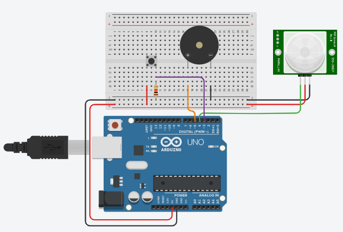

    <h1>Alarm project</h1>
    

## ¿De qué trata?

Este es un proyecto básico creado con Arduino cuyo fin es lograr una pseudo alarma de seguridad.

> _En la carpeta src tendrás dos archivos. Uno con extensión .cpp en caso de que uses VS Code, y otro con extensión .ino en caso de que uses el IDE de Arduino. Utiliza el archivo que te resulte más cómodo para subir el proyecto a la placa Arduino._

### Lista de componentes

- 1 Placa Arduino (te recomiendo usar Arduino UNO o Nano, puedes usar otras pero no lo veo necesario al ser un proyecto simple)
- 6 Jumpers Macho-Macho (colores a gusto)
- 3 Jumpers Hembra-Macho (colores a gusto)
- 1 Módulo PIR
- 1 Piezo (o un Buzzer Activo en su lugar)
- 1 Pulsador
- 1 Resistencia de 1k ohm

### Diagrama de conexiones

## ¿Cómo funciona?

- El módulo PIR detecta movimiento en su rango de visión y envía una señal HIGH al arduino.
- El arduino detecta la señal y envía un HIGH al Piezo.
- El piezo se activa y comienza a emitir vibraciones.

> Si quieres obtener un pitido bastante fuerte y agudo a modo de alarma, es mejor que reemplaces el Piezo por un Buzzer Activo (no confundir con un Buzzer Pasivo).

Para detenerlo, simplemente presionas el botón y la alarma se apagará al cabo de un momento.

> Cabe recalcar que el pulsador debe estar conectado a uno de los pines de interrupción. Estos ya vienen configuradas por defecto y dependen del modelo de placa Arduino que uses. Puedes hacer click [Aquí](https://aprendiendoarduino.wordpress.com/2016/11/13/interrupciones/) para ver más sobre el tema.

### Demo en Tinkercad

Aquí puedes ver una [Demo](https://www.tinkercad.com/things/likquBIq9um) para entender mejor el funcionamiento del circuito.

## Ideas para mejorar el proyecto

Puedes utilizar un módulo HC-05 o HC-06 para desactivar la alarma usando Bluetooth en lugar de usar un botón.
También puedes añadir un módulo GSM SIM800 o GSM SIM900 para enviar mensajes o realizar llamadas de forma automática cuando la alarma es activada.

## ¿Cómo puedo aportar a este proyecto?

- Crea un fork de mi repositorio.
- Clona el repositorio en tu PC.
- Crea una nueva rama y realiza los cambios que desees, añadiendo documentación.
- Sube los cambios a tu repositorio y realiza un Pull Request.

## Contáctame

[Instagram](https://instagram.com/wickedness__delirium) | [Correo](mailto:sam.alejandro.bustos@gmail.com) | [GitHub](https://github.com/zero10903)
